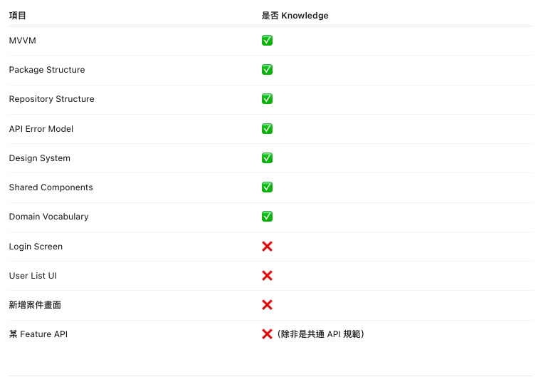
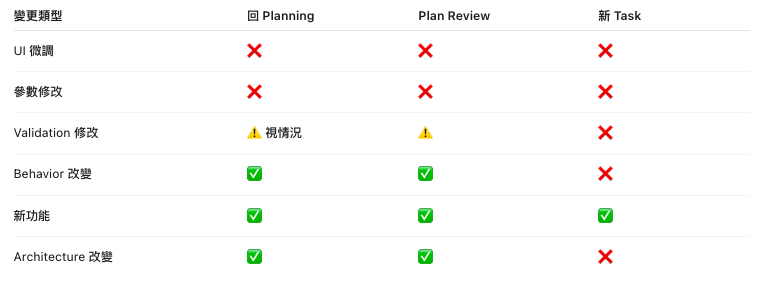

# AI Agent Developer Core:

> **Optional / on-demand:** 本 Tutorial 不是一般 Task 的 Required Reading。Agent 應先讀 `AGENTS.md`、Task `state.yaml` 與 `next_action` 對應的單一 primary Rule；只有需要解釋或範例時才讀本文件的相關章節，不得整份預載。

> 本文件以專案 `AGENTS.md` 的流程與檔案結構為準，以下內容保留原本說明方式，並補齊對齊項目。

`AGENTS.md` 是執行規則的唯一入口；本文件負責解釋流程與提供操作範例。兩者衝突時，以 `AGENTS.md` 為準。

## 五分鐘掌握專案資訊

第一次接手本專案時，依下列順序閱讀，不要先從大量程式碼開始：

1. `AGENTS.md`：確認生命週期、禁止事項、Gate、角色與 `next_action`。
2. `docs/architecture/overview.md`：掌握技術棧、實際架構、核心流程、入口畫面與模組責任。
3. `docs/product/land-survey-115/README.md`：由索引進入產品、資料、行為、介面與 API 規格。
4. `docs/tasks/<task-id>/state.yaml`：確認目前 phase、阻擋、已完成證據與下一步。
5. 若 Task 有 Knowledge artifacts，依序讀 `knowledge-collection.md`、`knowledge-resolution.md`、`knowledge-validation.md`，確認 active baseline。
6. 再讀該 Task 的 `requirement.md`、`analysis.md`、`plan.md`、`plan-review.md` 與最新驗證證據。

專案資訊卡：

| 項目 | 目前資訊 |
|---|---|
| 產品 | 新工處轄管土地占用調查 Android APP |
| 語言／平台 | Kotlin，Android 9+ |
| 架構 | 以 Activity、Fragment、Controller、Coordinator、Repository 為主的實務型 MVVM；非嚴格 MVVM |
| 核心能力 | 地圖土地查詢、勘查表單、CameraX 拍照、草稿保存、API 與照片同步 |
| 主要資料與服務 | Google Maps、Retrofit／OkHttp／Gson、Room、CameraX |
| 主要入口 | Login、MainActivity、Gutter Form／Inspect／Camera／Point Picker／Import |
| 任務記憶 | `docs/tasks/<task-id>/` |
| 流程入口 | `AGENTS.md` |

快速接手檢查：

- `state.yaml` 是否符合 canonical template
- Knowledge 是否為 `ready` 或有合理的 `not_required`
- requirement 與 Acceptance Criteria 是否已核准且可驗證
- plan-review 是否通過
- 工作分支、未提交變更、CI 與 Verification 證據是否對應同一 revision
- 是否存在 P0／P1、`NOT VERIFIED`、過期 Knowledge 或未解決 blocker

找不到 Task ID 時，先查看 `docs/tasks/` 與各 Task 的 `state.yaml`；不要用資料夾修改時間直接推定哪一個 Task 是正式工作項目。

## AGENTS.md 設置時機

### 建立時機

新專案在第一個開發 Task 開始前，就應在 repository root 建立 `AGENTS.md`。至少先定義：

- 專案技術與架構
- Success Flow 與 Fail Flow
- Agent Role Routing
- 必要輸入、輸出與 Task artifact 路徑
- Gate、狀態名稱與 `next_action`
- 全域禁止事項

### 更新時機

發生以下情況時，先更新 `AGENTS.md`，再讓新流程套用到後續 Task：

- 開發生命週期、Gate 或失敗回流規則改變
- 新增、移除或重新分工 Agent 角色
- Task 文件路徑、命名或必要產出物改變
- Architecture、測試、CI、Commit、Verification 或 Release 規則改變
- Knowledge source、Collection、Resolution、Validation、baseline 或 Ready gate 改變
- 新增所有 Task 都必須遵守的規格來源或安全限制

### 不應更新的情況

以下內容不應放進 `AGENTS.md`：

- 單一功能需求或畫面規格
- 單一 API payload
- 單次 Issue、Debug 證據或測試結果
- 某一個 Task 的實作細節

這些內容應放在 `docs/tasks/[task-id]/` 或對應的規格文件。修改 `AGENTS.md` 後，也要同步檢查本教學、角色規則與 templates，避免入口規則和實際產物不一致。

## Project Summary

`TaoYuanGutter` 是 Android Kotlin 土地／溝渠現場勘查 APP，支援地圖查詢、表單填報、CameraX 拍照、Room 草稿與後端同步，目標為 Android 9+。

架構是實務型 MVVM：UI 位於 Activity、Fragment 與 Bottom Sheet；流程邏輯多由 Controller／Coordinator 負責；網路與持久化由 Repository 負責；`MainViewModel` 只保存有限 UI state。詳細模組與入口以 `docs/architecture/overview.md` 為準，產品範圍以 `docs/product/land-survey-115/README.md` 及其子文件為準。

## Workflow
### Intake Flow

任務依賴多份產品規格、設計圖、API、資產、repository 或外部文件時，先執行 Knowledge Collection、Resolution 與 Validation。只有 Validation PASS、Knowledge Ready 後才能交給 Planning。單一、明確、最新且具權威性的需求可將 Knowledge 標記為 `not_required` 後直接進 Planning。



```text
Task Intake
    +-- clear requirement --> Planning
    +-- knowledge work required --> Collection --> Resolution --> Validation --> Ready --> Planning
```

### Success Flow
```
Task Intake
↓
Knowledge Collection / Resolution / Validation（需要時）
↓
Knowledge Ready
↓
Planning
↓
Plan Review
↓
Implementation
↓
Developer Validation
(Build / Local Test)
↓
Git Commit
↓
Code Review
↓
CI Quality Gate
↓
Verification
↓
UAT（需要時）
↓
Release
↓
Authorized Merge or Deployment
↓
Post-Deployment Verification / Monitoring（有部署時）
↓
Done
```
### Fail Flow
```
Verification FAIL
↓
Failure Classification
↓
Requirement -> Knowledge Collection / Resolution or Planning
Planning -> Planning
Implementation -> Debug
Environment -> Infrastructure
Unknown -> Investigation
```

只有 Implementation failure 會自動進入 Debug 修正迴圈；其他分類必須由各自角色處理後，再回到被阻擋的階段。

### Task Lifecycle

完整任務生命週期：

```text
Task
↓
Task Intake
↓
Knowledge Collection（需要時）
↓
Knowledge Resolution
↓
Knowledge Validation
↓
Knowledge Ready
↓
Planning
↓
Plan Review
↓
Implementation
↓
Developer Validation
↓
Git Commit
↓
Code Review
↓
CI Quality Gate
↓
Verification
↓
UAT（需要時）
↓
Release
↓
Authorized Merge or Deployment
↓
Post-Deployment Verification / Monitoring（有部署時）
↓
Done
```

- 若需求單一、清楚、來源最新且權威明確，可將 Knowledge 記為 `not_required`，由 Task Intake 直接進入 Planning。
- 

### Failure Classification

Verification FAIL 時必須先分類，再決定 `next_action`：

| Category | Meaning | Next Action |
|---|---|---|
| `requirement` | 需求缺漏、來源不清楚、過期或互相衝突 | 缺漏／過期進 `knowledge_collection`；衝突進 `knowledge_resolution`；Task requirement 不完整進 `planning` |
| `planning` | 計畫不完整或錯誤 | `planning` |
| `implementation` | 實作不符合需求或計畫 | `debug` |
| `environment` | CI、SDK、裝置或基礎設施問題 | `infrastructure` |
| `unknown` | 尚無足夠證據分類 | `investigation` |

只有 implementation failure 直接進入 Debug、Re-Implementation、Developer Validation、Commit、Verification 的修正迴圈。其他分類先由對應階段處理。

### Gates

```text
Task Sources Identified
↓
Knowledge Collection Complete（需要時）
↓
Knowledge Resolution Complete（需要時）
↓
Knowledge Validation PASS（需要時）
↓
Knowledge Ready
↓
Requirements Resolved
↓
Plan Approved
↓
Implementation Complete
↓
Developer Validation Complete or Limitations Recorded
↓
Git Commit
↓
Code Review Approved
↓
CI PASS
↓
Verification PASS
↓
UAT PASS（需要時）
↓
Release Approval
↓
Authorized Merge or Deployment
↓
Post-Deployment Verification PASS（有部署時）
↓
Monitoring Complete（需要時）
↓
Done
```

- Knowledge workflow 啟動時，未達 `knowledge_ready` 不得開始 Planning。
- Plan Review 未核准，不得開始 Implementation。
- Developer Validation 未完成或限制未記錄，不得宣告 Implementation 完成。
- Verification 必須檢查已 Commit 的 revision。
- `NOT VERIFIED` 不等於 PASS，不得進入 Release。
- CI、Verification 與 Release Approval 未通過，不得 Merge。
- Merge 或 Deploy 必須取得明確授權，完成後才能將 Task 設為 Done。

## Role Routing
```
Knowledge Collection
↓
ai/rules/knowledge/collection.md
Knowledge Resolution
↓
ai/rules/knowledge/resolution.md
Knowledge Validation
↓
ai/rules/knowledge/validation.md
Knowledge Ready
↓
Planning
↓
ai/rules/planning/planning.md
Plan Review
↓
ai/rules/planning/plan-review.md
Developer
↓
ai/rules/implementation/developer.md
Verifier
↓
ai/rules/verification/verification.md
Debug
↓
ai/rules/implementation/debug.md
Infrastructure
↓
ai/rules/operations/infrastructure.md
Investigation
↓
ai/rules/operations/investigation.md
Release
↓
ai/rules/operations/release.md
```

## Progressive Context Loading

每個角色只載入 `AGENTS.md`、目前 Task 的 `state.yaml`、`next_action` 對應的一份 primary Rule，以及該 Rule 明列的 current artifacts。完整 routing 以 `ai/README.md` 為準。

Coding、Testing、Git、Issue Management 與 Template Rules 都是 on-demand policies；只有當目前工作實際涉及對應行為時才讀取。產品、設計、API、程式碼與歷史 evidence 也只針對目前 claim、AC 或 affected scope 開啟，不得整個目錄預載。

若 primary Rule 不存在，該階段必須停止；不得用 Tutorial 或其他 phase Rule 推測缺少的執行契約。

## Issue Management
Issue Management is used when a task hits a blocker, regression, or requirement mismatch.

Keep `state.yaml` for the task's main phase and keep issue details in a separate issue log.

Required routing rules:
- `requirement_gap` returns to `knowledge_collection` when sources are missing or stale, `knowledge_resolution` when sources conflict, otherwise `planning`
- `planning_gap` returns to `planning`
- `implementation_regression` returns to `debug`
- `verification_failure` must first be classified by root cause
- `environment` returns to `infrastructure`
- `unknown` returns to `investigation`

Priority guidance:
- `P0` core flow broken or data risk
- `P1` major flow blocked
- `P2` local defect or edge case
- `P3` polish or non-blocking improvement

## Task Memory
任務資料請統一放在 `docs/tasks/[開發編號]/`，並維持與 `AGENTS.md` 相同的任務階段檔案。

跨 Task 的固定規格放在下列產品層文件，不要複製成每個 Task 各自維護的版本：

- `docs/product/`：產品目標、範圍、固定決策與 Acceptance Criteria
- `docs/design/`：畫面、元件、狀態、互動與 accessibility
- `docs/api/`：request、response、error、相容性與 retry contract
- `docs/assets/`：資產來源、授權、使用限制與 reuse 範圍

相關產品資料夾存在時，以其中已核准且仍有效的規格為準；Knowledge artifacts 的 canonical templates 位於 `ai/templates/`。Task 只引用相關規格；若 Knowledge workflow 啟動，必須依序建立 Collection、Resolution、Validation artifacts，不得由 Planning 或 Developer 自行猜測。

建議檔案：
```
docs/tasks/TYG-001/
├── knowledge-collection.md  ← 需要 Knowledge workflow 時建立
├── knowledge-resolution.md  ← Claim、衝突、決策與候選 baseline
├── knowledge-validation.md  ← Validation 結果與 active baseline
├── requirement.md
├── analysis.md
├── plan.md
├── plan-review.md
├── state.yaml
├── execution-report.md
├── issue-log.md             ← 發現 Issue 時建立
├── root-cause.md            ← Debug 時建立
├── fix-plan.md              ← Debug 時建立
└── verification.md
```

所有角色都先讀 `state.yaml`，再根據對應規則檔執行。Release decision 記錄在 `state.yaml`；需要獨立發布紀錄時，可依 `ai/rules/operations/release.md` 補充 release artifact。

## Stage Handoff

### Knowledge Collection

Collection 只負責找齊並登錄來源，不負責決定哪個產品行為正確。輸出 `knowledge-collection.md`，至少包含來源涵蓋範圍、Source Register、版本、權威、時效、缺漏、存取限制與初步衝突。

```yaml
phase: knowledge
status: knowledge_collected

knowledge:
  status: resolving
  collection: completed
  resolution: pending
  validation: pending
  baseline_id: null

next_action: knowledge_resolution
```

缺少或過期來源回到 Collection；來源存在但無法存取時進 Infrastructure；缺少必要的權威決策時進 Requirement Clarification。

### Knowledge Resolution

Resolution 讀取 Collection artifact，將來源整理為 Claim，處理衝突、缺口、Decision 與 Assumption，產生 candidate baseline。Resolution 完成不代表 Knowledge 已核准。

```yaml
phase: knowledge
status: knowledge_resolved

knowledge:
  status: validating
  collection: completed
  resolution: completed
  validation: pending
  baseline_id: KB-001

next_action: knowledge_validation
```

### Knowledge Validation and Ready

Validation 重新檢查 primary sources、domain authority、freshness、traceability、decision approval、assumption safety 與 candidate baseline 完整性。建議由不同於 Resolver 的角色執行；無法分離時必須留下直接證據。

PASS 後才啟用 baseline 並進入 Knowledge Ready：

```yaml
phase: knowledge
status: knowledge_ready

knowledge:
  status: ready
  collection: completed
  resolution: completed
  validation: passed
  baseline_id: KB-001

blocking: []
next_action: planning
```

Validation FAIL 必須依原因回到 Collection、Resolution、Requirement Clarification 或 Infrastructure。`NOT VERIFIED` 不得成為 Knowledge Ready。

### Planning

輸入：Task Requirement、Repository、Architecture、Existing Tests。

必要產出：

- `requirement.md`
- `analysis.md`
- `plan.md`
- `state.yaml`

Planning 進行中：

```yaml
phase: planning
status: plan_in_progress
```

Planning 完成：

```yaml
phase: planning
status: plan_ready
next_action: plan_review
```

### Plan Review

輸入：requirement、analysis、plan、state 與 Plan Critic Rules。只有核准後才能進入 Implementation。

```yaml
phase: plan_review
status: approved

plan_review:
  status: approved

next_action: implementation
```

需要修改時使用 `status: changes_requested` 與 `next_action: planning`；需求本身不清楚時使用 `status: blocked` 與 `next_action: requirement_clarification`。

### Development

輸入：approved `plan.md`、`state.yaml` 與 Developer Rules。Implementation 前必須確認 Plan Review 已核准。

完成實作、Developer Validation 與 Commit 後：

```yaml
phase: implementation
status: implementation_complete

implementation:
  status: completed

next_action: verification
```

### Verification

輸入：requirement、plan、CI、Git Diff、tests，並針對每一條 Acceptance Criterion 提供 PASS、FAIL 或 NOT VERIFIED 與證據。

PASS：

```yaml
phase: verification
status: verification_passed
next_action: release
```

FAIL：

```yaml
phase: verification
status: verification_failed

verification:
  result: fail
  category: implementation
  failed_acceptance_criteria:
    - AC-003

blocking:
  - AC-003

next_action: debug
```

NOT VERIFIED：

```yaml
phase: verification
status: verification_not_verified

verification:
  result: not_verified
  category: environment
  not_verified_acceptance_criteria:
    - AC-003

blocking:
  - Required device test was not available

next_action: infrastructure
```

若不需要 Infrastructure，只是仍待補充可取得的驗證證據，維持 `next_action: verification`。`NOT VERIFIED` 不得進入 Release。

### Debug and Re-Implementation

Implementation failure 先由 Debug 讀取 verification、failed AC 與 evidence，建立 `root-cause.md` 和 `fix-plan.md`。取得充分根因證據後：

```yaml
phase: debug
status: debug_complete

debug:
  status: completed
  root_cause: identified

next_action: implementation_debug
```

Developer 再依核准的 fix plan 進行 Re-Implementation、Developer Validation、建立新 Commit，最後回到 Verification。

### Infrastructure

Environment failure 由 Infrastructure 保存失敗命令、環境與修復證據，不得修改 production code，也不得把未執行檢查標成 PASS。處理後回到原本被阻擋的 Implementation 或 Verification。

### Investigation

Unknown failure 由 Investigation 收集證據並分類為 requirement、planning、implementation 或 environment，再交給 Knowledge Resolution、Planning、Debug 或 Infrastructure。證據不足時保持 blocked，不得猜測分類。

### Release

Release 確認 CI、Verification、Acceptance Criteria、P0/P1 Issue 與 release risk。通過後只表示等待人工授權：

```yaml
phase: release
status: release_ready

release:
  status: approved

next_action: human_release
```

取得 Authorized Merge 或 Deployment 證據後，才能更新為：

```yaml
phase: done
status: done

release:
  status: completed

next_action: none
```

## Workflow, Files Saved Structure, Storage Strategy

### Artifacts and execution evidence

1. `knowledge-collection.md`，Knowledge workflow 啟動時建立
2. `knowledge-resolution.md`，記錄 Claim、Conflict、Decision 與 candidate baseline
3. `knowledge-validation.md`，記錄 baseline validation 與 Knowledge Ready gate
4. `requirement.md`
5. `analysis.md`
6. `plan.md`
7. `plan-review.md`
8. `state.yaml`
9. `execution-report.md`
10. `issue-log.md`，發現 Issue 時建立
11. `root-cause.md` 與 `fix-plan.md`，進入 Debug 時建立
12. `verification.md`
13. Developer implementation、Git branch 與 commit
14. CI build、tests 與獨立 Verification evidence
15. Release decision 與 Authorized Merge 或 Deployment evidence

### Task-oriented storage

```text
Project
├── Repository
├── AGENTS.md                ← 團隊與 Agent 的強制入口規則
├── docs/tasks/TYG-001/      ← 單一 Task 的外部記憶
│   ├── knowledge-collection.md
│   ├── knowledge-resolution.md
│   ├── knowledge-validation.md
│   ├── requirement.md
│   ├── analysis.md
│   ├── plan.md
│   ├── plan-review.md
│   ├── state.yaml
│   ├── execution-report.md
│   ├── issue-log.md
│   └── verification.md
├── Thread A                 ← Planning / Analysis
├── Thread B                 ← Developer
└── Thread C                 ← Verifier / Reviewer
```

### Artifact-oriented storage

```text
Project/
├── app/
├── gradle/
├── build.gradle.kts
├── AGENTS.md
├── ai/
│   ├── README.md
│   ├── rules/
│   │   ├── knowledge/
│   │   ├── planning/
│   │   ├── implementation/
│   │   ├── verification/
│   │   ├── operations/
│   │   └── governance/
│   ├── templates/
│   │   ├── knowledge/
│   │   └── task/
│   └── tutorial/
│       ├── developer-guide.md
│       └── assets/
├── docs/
│   ├── architecture/
│   ├── product/
│   │   ├── templates/
│   │   └── land-survey-115/
│   ├── design/
│   │   └── templates/
│   ├── api/
│   │   └── templates/
│   ├── assets/
│   │   └── templates/
│   └── tasks/TYG-001/
│       ├── knowledge-collection.md
│       ├── knowledge-resolution.md
│       ├── knowledge-validation.md
│       ├── requirement.md
│       ├── analysis.md
│       ├── plan.md
│       ├── plan-review.md
│       ├── state.yaml
│       ├── execution-report.md
│       ├── issue-log.md
│       └── verification.md
```

## AI Agents For Rules

- `AGENTS.md`：Agent 入口與全域強制規則
- `ai/`：各角色的詳細執行規則
- `docs/tasks/[開發編號]/`：Task 規範、狀態與驗證證據

```text
AGENTS.md
ai/
├── README.md
├── rules/
│   ├── knowledge/collection.md, resolution.md, validation.md
│   ├── planning/planning.md, plan-review.md
│   ├── implementation/developer.md, coding.md, debug.md
│   ├── verification/testing.md, verification.md
│   ├── operations/infrastructure.md, investigation.md, release.md
│   └── governance/git.md, issue-management.md, templates.md
├── templates/
│   ├── knowledge/
│   └── task/
└── tutorial/developer-guide.md
docs/tasks/[開發編號]/
├── knowledge-collection.md
├── knowledge-resolution.md
├── knowledge-validation.md
├── requirement.md
├── analysis.md
├── plan.md
├── plan-review.md
├── state.yaml
├── execution-report.md
├── issue-log.md
└── verification.md
```

## AI Agents Developer Procedure
1) ***Knowledge Collection Agent***（需要盤點多來源、缺漏或時效時）
   + 掃描 Project / Product / Design / API / Repository / Test / Operations sources
   + 建立 Source Register、版本、權威、時效與 coverage
   + 輸出 `knowledge-collection.md`，交給 Resolution
2) ***Knowledge Resolution Agent***
   + Claim normalization、Source Authority、Conflict、Decision、Assumption
   + 輸出 `knowledge-resolution.md` 與 candidate baseline，交給 Validation
3) ***Knowledge Validation Agent***
   + 獨立檢查 primary evidence、freshness、traceability、approval 與 baseline completeness
   + 輸出 `knowledge-validation.md`；PASS 後設為 Knowledge Ready 並交給 Planning
4) ***Planning Agent / Analysis Agent***
   + Requirement Reader, 理解 Requirement （Requirement 由開發者提供，不憑空出現）
   + Repository Analyst
   + Impact Analyst
   + Implementation Planner
5) ***Plan Critic Agent / 反證AI***（Falsification / Negative Testing for Requirements ）
6) ***Develop Agent***
   + **Implementation**
   + code
   + tests
   + commit
7) PR and CI / CD
```
Verifier
├── Semantic verification
└── Acceptance Criteria

GitHub Actions
├── Build
├── Unit Test
├── Lint
└── Static checks
```
8) ***Verification AI Agent*** (**Adversarial Verification**)
   + Verifier & validation
   ``` 
   # TYG-001 有沒有正確完成？

   You are the independent verification engineer for TYG-001.

   Do NOT assume the implementation is correct.

   Read:

   docs/tasks/TYG-001/requirement.md
   docs/tasks/TYG-001/analysis.md
   docs/tasks/TYG-001/plan.md
   docs/tasks/TYG-001/state.yaml

   Review the changes between:

   main...feature/TYG-001-photo-upload

   Verify every Acceptance Criterion independently.

   Inspect:
   - implementation
   - git diff
   - tests
   - error handling
   - regression risks

   Run relevant tests where possible.

   Do NOT modify production code.

   For every Acceptance Criterion report:

   PASS
   FAIL
   NOT VERIFIED

   Include evidence.

   Create:
   docs/tasks/TYG-001/verification.md
   ```
   + Adversarial Verification
   ```
   Implementation 已經限制 5 張圖片
   這個 Implementation 要怎麼被弄壞？
   0 張
   1 張
   5 張
   6 張
   重複加入
   remove 再加入
   rotate
   process recreation
   ```
   + Verification Result
   + Verification Failure
      + 更新state.yaml
      ```
      phase: verification

      status: verification_failed

      verification:
        result: fail
        category: implementation
        failed_acceptance_criteria:
        - AC-002
        - AC-004

      blocking:
      - AC-002
      - AC-004

      next_action: debug
      ```
      + Debug Agent 先讀 `state.yaml`、`verification.md` 與 evidence，建立 `root-cause.md` 和 `fix-plan.md`。
      + 根因證據充分且 fix plan 核准後，Developer Agent 才依 `next_action: implementation_debug` 進行修正。
      + Regression
      + Crash Hypothesis
      + 迭代第二次...
      + Acceptance Criteria
9) Release Risk Analysis
```prompt
這個版本是否有：
Database Migration
Api Contract Change
Permission Change
Certificate Change
Gradle Change
Sdk Change
Proguard/R8 Risk
Background Execution Change
Security Risk
```
10) Tasks State (整理需求文件.md)
   + Task State 不等於開發日誌，它比較像「目前任務狀態表」；開發日誌是過程紀錄
   + 然後任何 Agent 接手, 先讀 state.yaml
## 多平台資源嫁接開發
+ Claude Code 官方文件明確建議，如果 repository 已有 AGENTS.md，可以建立一個很薄的 CLAUDE.md，用 AGENTS.md 匯入，再追加 Claude-specific instructions。Claude
+ Gemini CLI 官方文件則支援 context.fileName，甚至可以設定成同時讀 AGENTS.md、CONTEXT.md、GEMINI.md；它也提供 /memory show 查看實際載入的 context。
推薦發展：
```
Project/
│
├── AGENTS.md                 ← AI-neutral 共通規則
│
├── CLAUDE.md                 ← Claude adapter
├── GEMINI.md                 ← Gemini adapter
│
├── ai/
│   ├── README.md
│   ├── rules/
│   ├── templates/
│   └── tutorial/
│
└── docs/
    ├── architecture/
    ├── product/
    ├── design/
    ├── api/
    ├── assets/
    └── tasks/
```
其中最重要的是：
```
              AGENTS.md
                  │
         AI-neutral rules
                  │
       ┌──────────┼──────────┐
       ↓          ↓          ↓
     Codex      Claude     Gemini
                  │
                  ↓
          Same Repository
                  │
                  ↓
            Same Task State
```

## State Alignment
為了和 `AGENTS.md` 保持一致，建議補上這些狀態概念：

- Planning: `plan_in_progress` -> `plan_ready`
- Knowledge: `not_required`，或依序經過 `knowledge_collection_in_progress` -> `knowledge_collected` -> `knowledge_resolution_in_progress` -> `knowledge_resolved` -> `knowledge_validation_in_progress` -> `knowledge_ready`
- Plan Review: `review_in_progress` -> `approved` / `changes_requested` / `blocked`
- Implementation: `implementation_in_progress` -> `implementation_complete`
- Verification: `verification_in_progress` -> `verification_passed` / `verification_failed` / `verification_not_verified`
- Verification failure 要依分類切到 `debug`、`planning`、`infrastructure` 或 `investigation`
- Verification `NOT VERIFIED` 不得進入 Release
- Release: `release_ready` -> `human_release` -> `done`，Merge / Deploy 仍需明確授權
- Release readiness 使用 `next_action: human_release`；取得授權與執行證據後才更新為 `phase: done`

## Global Rules

所有角色與 Task 都必須遵守：

- 不修改已核准 requirement
- 不降低 Acceptance Criteria
- 不跳過必要測試
- 不執行與 Task 無關的 refactor

若執行過程發現需求需要改變，應停止目前階段並依 Failure Classification 進入 Knowledge Collection、Knowledge Resolution 或 Planning，不得由 Developer 或 Verifier 直接重寫需求。

## Task State
Task State 不等於開發日誌，它比較像「目前任務狀態表」；開發日誌是過程紀錄。
任何 Agent 接手前，先讀 `state.yaml`。

|情況 | 建議|
|----|-----|
|小 fix、單檔修改 | 可以由 1 個 Implementation Thread 完成 |
|一般 feat | 建議使用獨立 Implementation Thread |
|大型 feat | 拆成數個 implementation threads / worktrees |
|同一 feat 的第二輪修正 |	通常回原 Implementation Thread|
|完全不同 feat/fix | 開新 Thread 比較乾淨|
|Reviewer / Verifier | 建議每個 Task 有獨立驗證 Thread|
|Plan Critic | 小需求可共用一個 Critic Thread；重要需求建議獨立|
|長期共用「Developer Thread」| 不推薦|

## Operational Decisions

### 人工測試在哪個環節

人工測試可以出現在兩個位置：

- Developer Validation：Developer 在 Commit 前確認 Build、Local Test 與主要操作流程。
- Verification：Verifier 在已 Commit revision 上獨立驗證 Acceptance Criteria 與 regression。

無法執行的測試必須記錄為 NOT VERIFIED 或 execution limitation，不得宣告 PASS。

### 開發期間人工發現問題如何處理

先建立或更新 issue，記錄影響、重現方式、預期、實際結果、priority 與 category，再依分類處理：

- 規格來源缺漏、過期或版本不明進 Knowledge Collection；已收集來源互相衝突進 Knowledge Resolution；需求本身清楚但 Task requirement 不完整時回 Planning
- 實作 regression 回 Debug
- Verification failure 先分類根因，再依 requirement、planning、implementation、environment 或 unknown 路由
- 環境問題交給 Infrastructure
- 無法分類時進 Investigation

### 誰啟動下一個階段

`state.yaml` 的 `next_action` 是交接依據。AGENTS.md 沒有宣告所有階段會自動執行，因此由目前負責人、協調者或人工依 `next_action` 啟動下一個角色；接手 Agent 必須先讀最新 `state.yaml`。

### 誰執行 Commit

Developer 在 Implementation 與 Developer Validation 完成後建立 Commit。Verifier 只驗證已 Commit revision，不修改 production code；CI 與 Verification PASS 後仍須通過 Release Review，取得明確授權才由流程負責人或人工執行 Merge 或 Deploy，最後更新為 Done。
