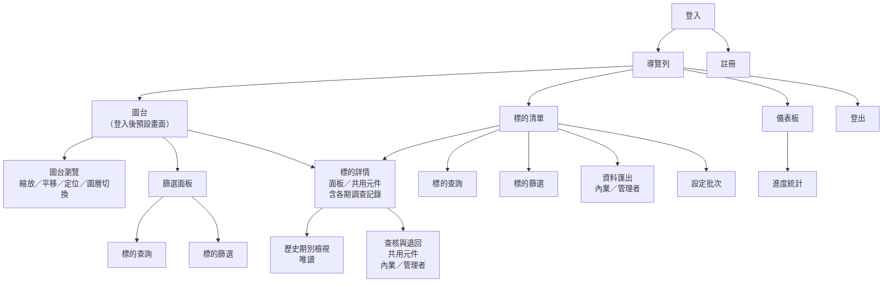
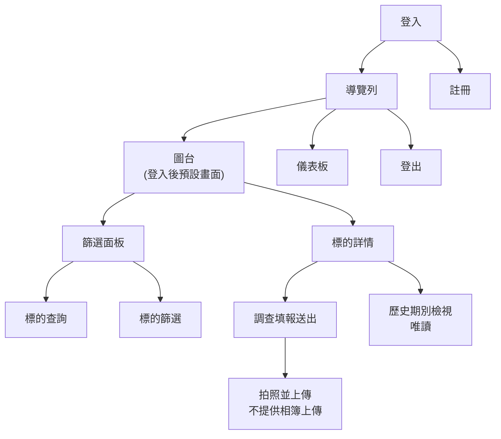

# 1. 系統概述與角色權限

# 1.1 系統定位

本系統為新工處轄管土地占用調查成果之查詢與登錄平台，分 WEB 與 APP 兩個端點，供公司內部與外包廠商使用。

本次調查範圍為實地勘查土地現況（清冊 L~T 欄），不含協調訪查作業。

| 端點 | 主要使用者 | 主要用途 |
| --- | --- | --- |
| WEB | 廠商(內業) | 查詢土地資料、審查外業調查成果、資料展示與管理 |
| APP | 廠商(外業) | 現場勘查、填寫實地勘查土地現況資料 |

# 1.2 主要功能清單

| 模組 | 說明 | WEB | APP |
| --- | --- | --- | --- |
| 登入登出 | 同時只能於一個裝置登入；Token 效期永久 | ✓ | ✓ |
| 註冊 | 密碼二次驗證 | ✓ | ✓ |
| 圖台 |  |  |  |
| 圖台瀏覽 | 縮放、平移、底圖切換、定位(APP) | ✓ | ✓ |
| 土地查詢 | 依地號或土地坐落 | ✓ | ✓ |
| 土地篩選 | 依清冊屬性欄位 | ✓ | ✓ |
| 土地詳情 | 土地標示、套匯圖資、實地勘查土地現況三個區塊 | ✓ | ✓ |
| 調查填報 | 表單編輯、送出（6 個可輸入欄位，勘查時間、勘查人員由系統帶入） |  | ✓ |
| 照片上傳 | 一筆土地4 張 |  | ✓ |
| 既有資料編輯 | 針對「外業調查完成」資料進行編輯 | ✓ | ✓ |
| 查核與退回 | 含退回意見 | ✓ |  |
| 清單 |  |  |  |
| 土地清單 |  | ✓ |  |
| 土地查詢 | 依地號或土地坐落 | ✓ |  |
| 土地篩選 | 依清冊屬性欄位 | ✓ |  |
| 土地詳情 | 土地標示、套匯圖資、實地勘查土地現況三個區塊 | ✓ |  |
| 查核與退回 | 含退回意見 | ✓ |  |
| 設定批次 | 將篩選結果統一設定批次 | ✓ |  |
| 資料匯出 | .excel、.csv | ✓ |  |
| 儀表板 |  |  |  |
| 進度統計 | 數據統計、圖像化表示 | ✓ | ✓ |

# 1.3 Sitemap

### WEB

### APP

# 1.4 角色與權限矩陣

| 角色 | 對應對象 | 取得方式 |
| --- | --- | --- |
| 調查人員 | 廠商外業 | 自行註冊，作業性質選「外業人員」 |
| 內業人員 | 廠商內業、日陞內業 | 自行註冊，作業性質選「內業人員」 |
| 管理者 | 機關、日陞團隊成員 | 由後端建置 |

### WEB

| 功能 | 調查人員 | 內業人員 | 管理者 | 備註 |
| --- | --- | --- | --- | --- |
| 註冊／登入／登出 | ✓ | ✓ | ✓ |  |
| 圖台瀏覽／土地查詢／篩選 | ✓ | ✓ | ✓ |  |
| 土地資料頁籤（土地標示＋套匯圖資，唯讀） | ✓ | ✓ | ✓ |  |
| 實地勘查土地現況－檢視 | ✓ | ✓ | ✓ |  |
| 實地勘查土地現況－編輯（狀態＝外業調查完成／已修正時） | — | ✓ | ✓ | 勘查時間、勘查人員維持原值不可改 |
| 實地勘查土地現況－編輯（狀態＝已查核） | — | — | ✓ | 已查核鎖定，僅管理者可再編輯 |
| 調查填報（送出） | ✓ | — | ✓ |  |
| 查核通過／退回（含填寫退回意見） | — | ✓ | ✓ |  |
| 土地清單－查詢／篩選 | ✓ | ✓ | ✓ |  |
| 設定批次（清單頁批次操作） | — | ✓ | ✓ |  |
| 資料匯出 | — | ✓ | ✓ |  |
| 儀表板（調查進度／分區進度） | ✓ | ✓ | ✓ |  |

### APP

| 功能 | 調查人員 | 內業人員 | 管理者 |
| --- | --- | --- | --- |
| 註冊／登入／登出 | ✓ | ✓ | ✓ |
| 圖台瀏覽／土地查詢／篩選 | ✓ | ✓ | ✓ |
| 土地詳情檢視 | ✓ | ✓ | ✓ |
| 調查填報（含拍照上傳） | ✓ | — | ✓ |
| 儀表板（進度統計） | ✓ | ✓ | ✓ |

狀態為「已查核」之記錄，調查人員不得再行編輯。
