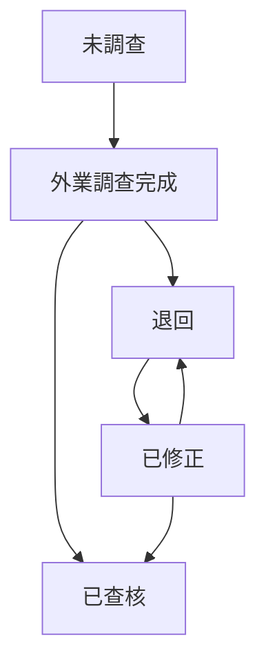

# 3. 系統行為規則

# 3.1 調查狀態流轉

調查狀態共五種值

| 目前狀態 | 觸發動作 | 變更狀態為 | 執行角色 |
| --- | --- | --- | --- |
| 未調查 | 填寫實地勘查土地現況並送出 | 外業調查完成 | 廠商(外業) |
| 外業調查完成 | 點擊「退回」並填寫退回意見 | 退回 | 廠商(內業)、日陞 |
| 退回 | 修正實地勘查土地現況並重新送出，於確認彈窗中點擊確認 | 已修正 | 廠商(外業) |
| 已修正 | 點擊「退回」並填寫退回意見 | 退回 | 廠商(內業)、日陞 |
| 已修正 | 點擊「查核通過」 | 已查核 | 廠商(內業)、日陞 |
| 外業調查完成 | 點擊「查核通過」 | 已查核 | 廠商(內業)、日陞 |

規則：

- 狀態變更僅能由上述動作觸發，不提供直接指定
- 退回時必須填寫退回意見，意見顯示於 APP 土地詳情頂部，直至重新送出
- 狀態變更為「退回」時，系統依 [§2.4.2.2](./2%20資料規格.md#2422-退回快照) 儲存欄位 4~10 快照，供內業人員比對原始資料與修正後資料；外業於退回狀態修正後重新送出（變更為「已修正」），快照維持不變，不隨新資料更新
- 廠商(外業)編輯退回資料送出時會跳出「確認是否完成修正」彈窗，點擊確認則變更為已修正
- 廠商(內業)及日陞於審查階段可直接修改實地勘查土地現況之可輸入欄位，系統帶入欄位維持原值不可改，修改紀錄由後端保留
- 狀態為「已查核」後，僅管理者可編輯

# 3.2 欄位條件必填規則

| 規則 | 檢核時機 |
| --- | --- |
| 現場勘查土地情形選取「無占用」時，不得再輸入除「土地座落」外的其他欄位 | 填寫 |
| 現場勘查土地情形非「無占用」時，占用型態、占用戶數、占用門牌號為必填 | 送出 |
| 現場勘查土地情形選取「無占用」時，占用型態、占用戶數、占用門牌號自動隱藏並清空 | 填寫 |
| 占用戶數須為 ≧1 之整數 | 填寫 |
| 照片4張 | 送出 |
| 退回時退回意見為必填 | 退回 |

# 3.3 錯誤處理與前端反應

後端錯誤碼定義見 API 規格書，前端對應行為如下：

| 狀態碼 | 情境 | 前端行為 |
| --- | --- | --- |
| 401 | 未登入或 Token 失效 | 導回登入頁，提示「登入已逾期，請重新登入」 |
| 403 | 權限不足 | 提示「權限不足」，不變更畫面 |
| 404 | 查無資料 | 於面板或清單顯示查無資料訊息，不關閉面板 |
| 409 | 資料衝突 | 於對應欄位顯示衝突訊息，保留已填內容 |
| 422 | 參數或驗證錯誤 | 於對應欄位顯示錯誤提示，保留已填內容 |
| 500 | 伺服器錯誤 | 顯示系統錯誤訊息，提供重試 |

未登入狀態下存取任何功能一律導回登入頁。

# 3.4 登入與登出

## 3.4.1 登入

| 項目 | 規格 |
| --- | --- |
| 登入欄位 | 帳號、密碼，均為必填 |
| 密碼欄位 | 遮罩顯示 |
| 驗證碼 | 4碼數字 |
| 裝置限制 | 同時只能於一個裝置登入 |
| 登入成功 | 取得角色權限與 Token，跳轉至圖台主畫面 |
| 登入失敗 | 顯示「帳號、密碼或驗證碼錯誤」 |

## 3.4.2 註冊

| 項目 | 規格 |
| --- | --- |
| 帳號格式 | 僅限英、數，最多 30 字元 |
| 註冊成功 | 返回登入頁，由使用者使用新帳號登入 |

## 3.4.3 登出與工作階段

| 項目 | 規格 |
| --- | --- |
| 登出按鈕位置 | 頂部導覽列右上角 |
| 登出行為 | 清除 Session Token，跳轉回登入頁 |
| Token 效期 | 永久 |
| Session 逾期 | Token 失效後操作任何功能自動導回登入頁，提示「登入已逾期，請重新登入」 |
| 未登入存取 | 回傳 401，導回登入頁 |
